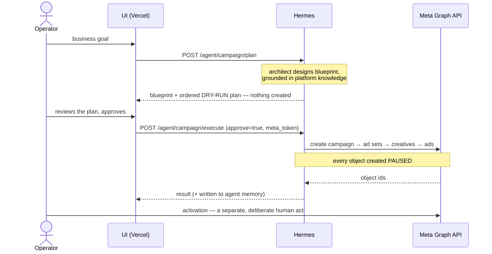

# AGNT SCALE — Hermes Agent Runtime

[](https://github.com/raphsoundmix-ctrl/agnt-scale-hermes/actions/workflows/ci.yml)


> **An AI decision layer for Meta Ads that is allowed to think, but not allowed to spend.**

Hermes is the server-side brain of **AGNT SCALE**: a multi-agent runtime that reads a live
Meta ad account, forms an opinion — Kill / Hold / Scale, campaign blueprints, creative
critique — and returns every money-moving action as a **dry-run proposal a human approves**.

Two repositories, one product:

| | Repo | Role |
|---|---|---|
| **Brain** | `agnt-scale-hermes` *(this one)* | Agents, memory, Meta execute/optimize, orchestration |
| **Surface** | [agnt_scale_meta](https://github.com/raphsoundmix-ctrl/agnt_scale_meta) | Next.js on Vercel — auth, Meta OAuth, dashboards, proxy to Hermes |

`FastAPI` · `Claude via OpenRouter` · `Postgres + pgvector (RLS)` · `Meta Marketing API` ·
`MCP` · `Docker` · `Tailscale Funnel`

---

## Why this repository is worth reading

It is a production-shaped system, not a demo wrapper around a chat completion:

- **Money-moving actions are gated by construction.** Writes are dry-run at the tool layer,
  not by asking the model nicely. Everything the executor creates is created `PAUSED`.
- **Tenant isolation is enforced by Postgres RLS**, under a non-superuser role with
  `FORCE ROW LEVEL SECURITY` — not by remembering a `WHERE` clause.
- **The verdicts are deterministic.** Kill / Hold / Scale is arithmetic with a Wilson lower
  confidence bound. The LLM writes the explanation; it does not cast the vote.
- **Cost is designed, not discovered.** Model tiering, split system prompts with prompt
  caching, and local CPU embeddings that never send memory text off the server.
- **It notices when Meta changes underneath it**, by learning from live API errors rather
  than scraping a changelog.
- **The money-adjacent logic is tested and CI-gated.** Verdict thresholds, Wilson bounds,
  payload builders and the dry-run gate are covered in `Hermes/tests/` — deliberately
  runnable with zero keys, zero DB and zero mocks, because if a test there ever needs a
  mock HTTP layer, the write gate is broken. A TS↔Python parity harness runs on every
  deploy. Threat model: [`SECURITY.md`](SECURITY.md).

The reasoning behind each of those is written down in
**[`docs/engineering-approach.md`](docs/engineering-approach.md)** — including the things I
deliberately refused to build.

---

## Architecture

```
┌──────────────────────────────────────────────────────────────┐
│  agnt_scale_meta  (Next.js · Vercel)                         │
│  UI · auth · Meta OAuth · dashboards · encrypted tokens      │
│  contains no agent logic — it proxies                        │
└───────────────────────────┬──────────────────────────────────┘
                            │  X-Internal-Token
                            │  account_id = workspaceId
                            │  meta_token = decrypt(OAuth), per request
                            ▼
┌──────────────────────────────────────────────────────────────┐
│  Hermes  (this repo) — the brain                             │
│  agents · RLS memory · optimizer · campaign execute          │
│  llm_router · platform knowledge · drift watcher             │
│  :7778 host  ·  Tailscale Funnel :8443 (prod, token-gated)   │
└───────────────────────────┬──────────────────────────────────┘
                            │  Graph API v22.0
                            ▼
                    Meta Marketing API
```

Hermes stores **no** Meta OAuth tokens. The app holds them encrypted and passes one
decrypted `meta_token` per request, so the brain stays stateless on credentials.

Full detail: [`docs/agnt-scale-architecture.md`](docs/agnt-scale-architecture.md) ·
[`docs/meta-oauth-hermes-bridge.md`](docs/meta-oauth-hermes-bridge.md)

---

## The agent roster

| Agent | Tier | Job |
|---|---|---|
| `objective_interpreter` | Sonnet | Business goal → Meta objective + the *true* KPI (CPA / ROAS / CPL, never vanity metrics) |
| `campaign_architect` | Sonnet | Objective → launchable blueprint: CBO vs ABO, optimization goal, bid strategy, targeting, pixel |
| `ad_setting` | Sonnet | Executes setup through the official Marketing API. Dry-run first, approval per action |
| `optimizer` | Sonnet | Insights → Kill / Hold / Scale → budget and status proposals |
| `creative_strategic` | Sonnet | Scores creatives 1–10: hook strength, CTA, cluster, kill signal |
| `script_writer` | Sonnet | Hook (0–3s) → body → CTA, followed by a humanisation pass over the copy |
| `assistant` | Haiku | Fast operational answers and routing |
| `orchestrator` | Sonnet | Reads **all** agents' memory in the account (RLS-permitted) and synthesises one answer |

---

## The operating rules it enforces

Domain logic lives in code, so it is testable and defensible to a client:

```
spend < $50                                → no verdict (the sample is noise)
spend ≥ $50 and 0 conversions              → KILL
ROAS < 50% of target at spend ≥ $50        → KILL
target met AND ≥10 conversions behind it   → SCALE  (+20%, learning-phase safe)
everything else                            → HOLD
```

- Rate metrics get a **Wilson lower confidence bound**, so 2 clicks on 40 impressions never
  reads as a 5% CTR winner (`services/engine/wilson.py`, a parity-tested port of the
  TypeScript original).
- **Attention is not a business result.** Reach, CTR and ThruPlay do not justify a Scale.
  That rule is in the agent prompts *and* in the thresholds.
- **Every created object is `PAUSED`.** Approving a plan and starting spend are two
  separate human acts.
- Scaling moves in `+20%` steps because larger jumps re-enter the learning phase.

### The approval path

The core product decision, end to end — note where the human sits:



Same pattern on the optimize side: verdicts arrive as dry-run proposals carrying an
`apply` payload; a human triggers the apply.

---

## Engineering decisions

| Decision | Why | Where |
|---|---|---|
| Brain holds no Meta tokens | A compromise here leaks no long-lived ad-account access | `routers/agnt_agent.py` |
| Postgres RLS, `FORCE`, non-superuser role | A buggy query returns nothing instead of another tenant's data | `migrations/002_rls.sql`, `services/agnt_memory.py` |
| `account_id` fails closed | No silent `_global` fallback — that is how one client's memory reaches another's context | `_require_account_id` |
| Writes dry-run by default at the tool layer | An LLM told "ask first" will eventually not ask. The gate must be structural | `services/meta/tools.py`, `client.py` |
| Deterministic verdicts, LLM explanations | Thresholds and confidence bounds are reproducible and arguable; prose is not | `services/meta/optimizer.py` |
| Model tiering + split system prompt | Haiku for latency, Sonnet for reasoning; static persona cached, dynamic context never | `services/llm_router.py` |
| Local embeddings (`bge-small-en-v1.5`, 384-dim) | No API key, no per-token cost, memory text never leaves the server | `services/embeddings.py` |
| Vectors in Postgres, not Qdrant | One isolation mechanism instead of two | `services/agnt_memory.py` |
| Drift learned from live API errors | Changelog scraping breaks; error text patterns do not | `services/meta/watcher.py` |
| Prompts never auto-deploy | Silent prompt drift on real budgets is an incident with no audit trail | `Hermes/FUTURE_WORK.md` |
| Isolation contract written before the code | This host runs an unrelated project; ports, names and paths reserved up front | `ISOLATION.md` |
| Memory maintenance shipped dormant | At 14 rows, enabling TTL would have been theatre. Config change later, not a project | `services/mem_maintenance.py` |

---

## How I build an agent

Every agent in this roster went through the same pipeline — the one I use for my own and
client agents outside this repo as well.

**1. Start from the job, not the model.** One agent = one job with a definable failure
cost. The failure cost decides the split: anything a client could argue with (a Kill
verdict, a budget step) is deterministic code; judgment and synthesis go to the model.

**2. Ground truth before prompts.** An agent is only as good as the facts it argues from,
so I collect source-of-truth material — official API docs, platform changelogs, my own
campaign data — and distill it into a primer the agent retrieves. Here that is
`services/meta/knowledge.py`, seeded into platform-knowledge memory and kept current by the
drift watcher. No blog folklore in the context window.

**3. Prompt and logic as separate artifacts.** The prompt carries persona and judgment;
thresholds, gates and money rules live in code. Output is a strict JSON contract, so
downstream code never parses prose.

**4. Obsidian as the local knowledge base and agent memory.** Design docs, ADRs and
operating playbooks live in a local Obsidian vault — this system's design contract is ADR
**Р-31** there. For personal agents the vault *is* the database and memory: agents read and
write plain markdown. Local-first, versionable, greppable, zero vendor lock-in. When a
project graduates to multi-tenant production, the same memory model is re-implemented on
Postgres + RLS — which is exactly what this repo is.

**5. Code memory + graphify, for token economy and fast recall.**
- *Code memory* — durable knowledge is stored as compact structured artifacts (enums,
  tables, manifests) instead of prose. `knowledge.py` is the in-repo example: the whole
  ODAX objective model with per-objective defaults loads into context in a few hundred
  tokens.
- *Graphify* — vault notes are linked into a graph, so retrieval walks relations from the
  entry node and injects only the top connected notes instead of embedding-searching a
  whole corpus. The in-repo equivalent is deliberately scoped semantic recall: top-3/top-4
  rows, hard-capped snippet lengths, RLS-fenced.

Both compose with the caching split in `llm_router.py`: static persona cached, dense
retrieved context appended uncached.

**6. Evals before autonomy.** Mock mode makes the whole surface exercisable offline;
features ship dormant and get enabled on evidence; prompts never self-deploy to accounts
moving real budget. Autonomy is earned per agent, not granted by default.

---

## API surface

All routes require `X-Internal-Token`; only `/health*` is public.

**Agents & memory**

| Endpoint | Does |
|---|---|
| `GET /agent/agents` | Roster with live model per agent |
| `POST /agent/chat` | Conversational. Per-agent short-term memory; orchestrator pulls cross-agent semantic memory |
| `POST /agent/run` | Structured task → strict JSON (creative critique / script + humanise / diagnosis), persisted long-term |
| `POST /agent/note` | Write-gate: only durable, signal-bearing facts reach long-term memory |
| `POST /agent/memory/search` | Semantic recall (cosine, RLS-scoped) |
| `POST /agent/memory/maintain` | TTL / dedup / cap sweep — dry-run by default |
| `GET /agent/memory/ping` | RLS round-trip probe |

**Meta Ads**

| Endpoint | Does |
|---|---|
| `POST /agent/meta` | Accounts, insights, campaigns, ad sets, ads, pixels, interests + approved writes |
| `POST /agent/campaign/plan` | Goal → blueprint → ordered **dry-run** plan. Nothing is created |
| `POST /agent/campaign/execute` | Approved blueprint → live campaign, ad sets, creatives, ads — all `PAUSED`. Requires `approve=true` |
| `POST /agent/campaign/optimize` | Insights → Kill / Hold / Scale → dry-run proposals with an `apply` payload |
| `POST /agent/meta/learn` | API version check + recent platform learnings (cron tick) |

Without a workspace Meta connection, Meta routes answer `409` rather than guessing.

---

## MCP server

`meta_mcp.py` exposes the campaign surface to any MCP client (Claude Code, Cursor) as a thin
stdio bridge — logic, memory and tokens stay on the server. Tools: `meta_read`,
`campaign_plan`, `campaign_execute`, `campaign_optimize`, `meta_learn`.

Setup: [`docs/meta-mcp.md`](docs/meta-mcp.md)

---

## Run it

```bash
cp .env.example .env
cp Hermes/.env.example Hermes/.env     # fill in OPENROUTER_API_KEY, HERMES_INTERNAL_TOKEN, DB password

docker compose up -d --build

# migrations (004 rebuilds the embedding column — read before running)
cat Hermes/migrations/00{1,2,3,4,5,6,7}*.sql | docker exec -i agnt-postgres psql -U agnt -d agnt

curl localhost:7778/health
```

`META_MOCK=1` returns fixtures for the entire Meta surface, so the runtime is fully
exercisable without a Meta token.

**Tests** — the deterministic core runs anywhere, with no keys and no DB:

```bash
pip install pytest pydantic httpx
pytest Hermes/tests -q                          # verdicts, payload builders, dry-run gate
python -m services.engine._parity               # from Hermes/ — TS↔Python parity
```

CI runs both on every push (`.github/workflows/ci.yml`).

Server self-update: `./deploy.sh` — pulls, syncs, rebuilds, health-checks, and runs the
engine parity test. It never touches `.env` and never runs migrations on its own.

---

## Where this goes next

The runtime is a foundation, not a finished product. The plan —
**[`docs/roadmap.md`](docs/roadmap.md)** — has two themes:

- **Hermes Agent**: a real tool-calling loop where agents choose their own Meta calls inside
  a fenced allowlist, with side-effecting tools intercepted into proposals rather than
  executed, bounded steps, and a persisted trace per `run_id`.
- **A base of custom agents**: agents as versioned manifests (tier, tools, memory scope,
  output contract, golden eval set) instead of a Python dict — so a new agent is a manifest
  and an eval set, and a prompt change is a version bump gated on an eval run, with
  rollback.

Nearest concrete wins: closing the creative loop (script → generated media → uploaded
creative → measured → scored back into memory), an offline eval harness built on the
existing mock mode, a scheduled optimize tick feeding an approval queue, and a CRM
attribution bridge so CPA is *true* CPA.

---

## Documentation

| Doc | What's in it |
|---|---|
| [`docs/engineering-approach.md`](docs/engineering-approach.md) | How I scope and build this — principles with the code that enforces them, and what I refused to build |
| [`docs/toolchain.md`](docs/toolchain.md) | Every tool in the stack and why that one; model economics |
| [`docs/roadmap.md`](docs/roadmap.md) | Hermes Agent + the custom agent base, in implementable detail |
| [`docs/agnt-scale-architecture.md`](docs/agnt-scale-architecture.md) | Two-layer architecture and the live Meta chain |
| [`docs/meta-oauth-hermes-bridge.md`](docs/meta-oauth-hermes-bridge.md) | Meta App setup, OAuth scopes, env wiring |
| [`docs/meta-mcp.md`](docs/meta-mcp.md) | The custom MCP server |
| [`SECURITY.md`](SECURITY.md) | Threat model — trust boundaries, what closes each one, and where |
| [`ISOLATION.md`](ISOLATION.md) | Shared-host isolation contract — reserved ports, names, paths |
| [`Hermes/FUTURE_WORK.md`](Hermes/FUTURE_WORK.md) | What is deferred, and the reasoning for deferring it |
| [`Hermes/docs/AGENT_MEMORY_AUDIT.md`](Hermes/docs/AGENT_MEMORY_AUDIT.md) | Memory schema audit and maintenance design |

> Some files (`legal.py`, `visual_worker.py`, `fal_video.py`, `knowledge/`, `skills/`) are
> inherited scaffolding from an earlier runtime and are dormant here. Kept for reference,
> safe to prune.

---

## Author

**Raphael Kuldashev** — AI Automation Engineer · Forward-Deployed Engineer (FDE) ·
Anthropic-certified AI Engineer.

I design and ship production-ready AI agents and automation systems for businesses that
need to scale without the overhead: multi-agent LLM backends (Claude · OpenAI), n8n and
Python orchestration across 10+ external APIs, and generative content pipelines — video
(Kling, Seedance), image (Nano Banana Pro), voice (ElevenLabs) — grounded in 10+ years of
sound design and game audio. This repo is one of those systems: my Meta Ads operating
playbooks encoded as agents, with the approval gates a real ad budget requires.

**Stack:** Python · FastAPI · n8n · Docker · PostgreSQL · Supabase · Redis · MCP · Claude Code

[LinkedIn](https://www.linkedin.com/in/raphael-kuldashev/?locale=en) · open to roles and
collaboration in AI automation, agent engineering, and performance marketing.
